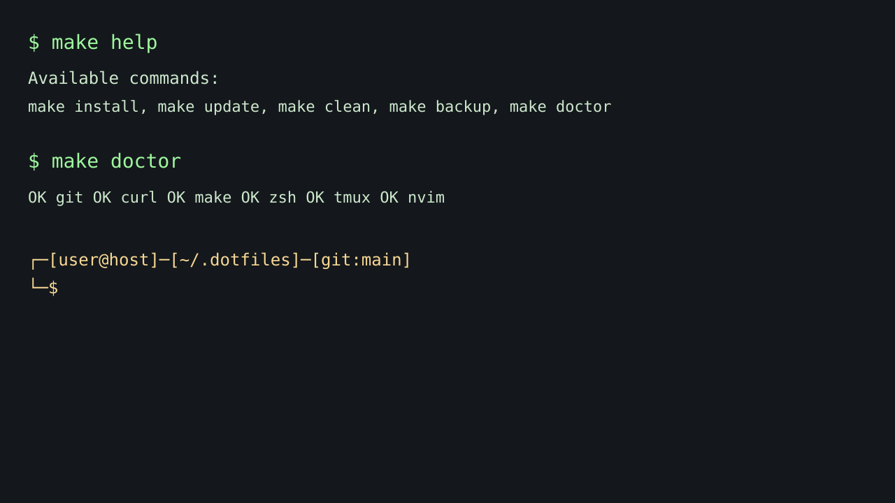

# 🚀 Dotfiles

> One command to bootstrap a reproducible developer environment.

## Quick start

```bash
git clone https://github.com/username/dotfiles.git ~/.dotfiles
cd ~/.dotfiles
make install
```

## Included
- Neovim (lazy.nvim, LSP for Python/Go/Lua)
- Tmux (vim navigation, mouse, resurrect/continuum)
- ZSH (aliases, exports, custom prompt)
- Git global config and ignore

## Commands
- `make install`
- `make update`
- `make clean`
- `make backup`
- `make doctor`

## Preview

